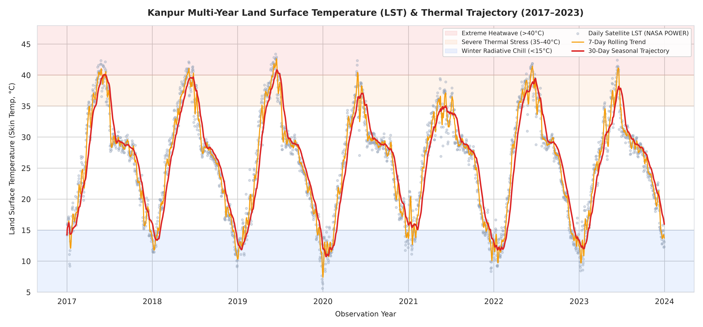
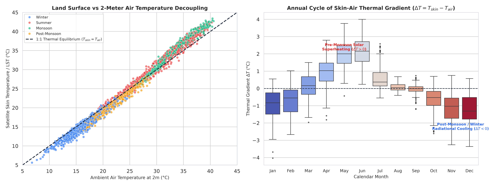
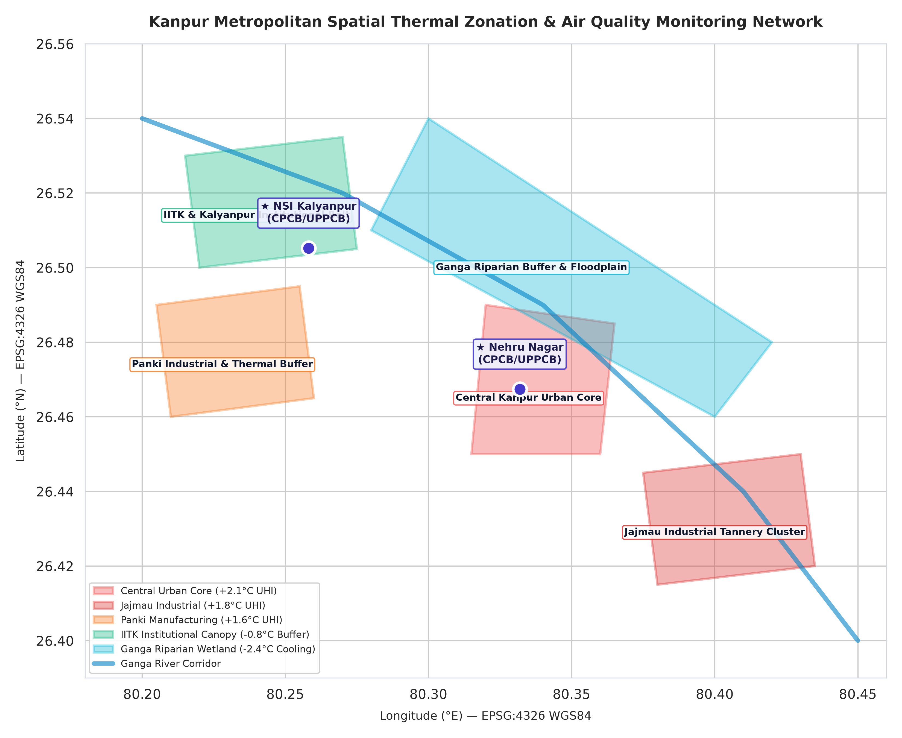
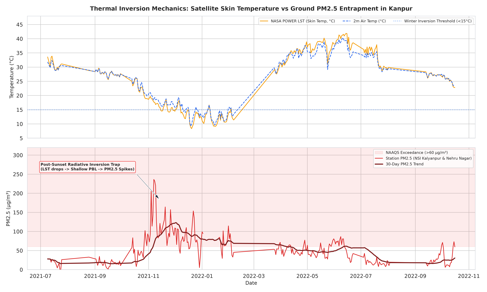
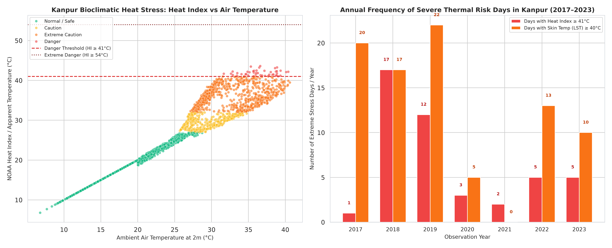
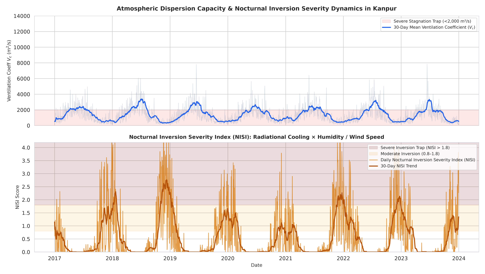
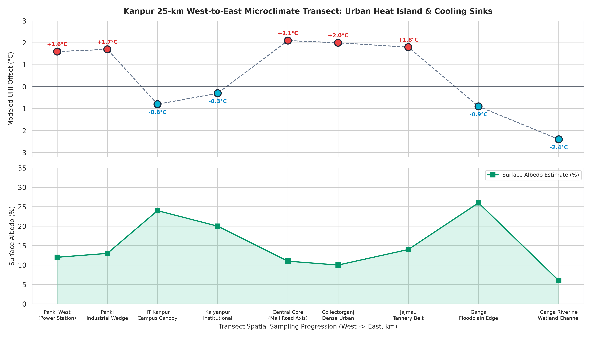

# Kanpur Land Surface Temperature (LST) & Urban Inversion Dynamics

**Satellite Earth Observation, MERRA-2 Reanalysis, QGIS Microclimate Spatial Modeling & Interactive Web GIS (2017–2023)**

[](https://github.com/avnish36singh-arch/Kanpur-LST-Thermal-Analysis-GIS/actions)
[](https://www.python.org/downloads/)
[](https://power.larc.nasa.gov/)
[](https://qgis.org)
[](web/index.html)
[](LICENSE)

> **Dedicated Remote Sensing & GIS Repository**  
> • **Domain**: Kanpur Metropolitan Basin ($26.4499^\circ\text{N}, 80.3319^\circ\text{E}$), Indo-Gangetic Plain, Uttar Pradesh, India  
> • **Ground CAAQMS Sibling**: [Air-Quality-Analysis-Kanpur](https://github.com/avnish36singh-arch/Air-Quality-Analysis-Kanpur)  
> • **Regional Sibling**: [delhi-air_qaulity_cpcb](https://github.com/avnish36singh-arch/delhi-air_qaulity_cpcb)  
> • **Web Portal**: Interactive browser visualizer with Leaflet vector GIS, Chart.js telemetry, and microclimate simulator.

---

## Abstract

This repository provides an autonomous, production-grade remote sensing and geospatial analytics pipeline investigating multi-year **Land Surface Temperature (LST)**, radiant skin-to-air thermal decoupling, and urban heat island (UHI) microclimate gradients across Kanpur, Uttar Pradesh.

Covering **2,556 consecutive daily observations (2017–2023)** retrieved from the **NASA POWER API (MERRA-2 assimilation reanalysis)**, coupled with **UPPCB Continuous Ambient Air Quality Monitoring Stations (CAAQMS)** and **QGIS 3.x vector spatial microclimate layers**, the platform establishes the physical thermodynamic mechanisms governing nocturnal boundary layer collapse and particulate trapping in the central Indo-Gangetic Plain.

---

## Key Scientific Findings

- **Seven-Year Continuous Climatology**: 2,556 unbroken daily records. Mean LST: **$25.96^\circ\text{C}$**, Mean Air Temp: **$25.87^\circ\text{C}$**. Peak summer skin temperature: **$43.39^\circ\text{C}$** (June 12, 2019); winter minimum: **$5.61^\circ\text{C}$** (December 30, 2019).
- **Summer Solar Superheating ($\Delta T > 0$)**: In pre-monsoon summer (April–June), radiant skin temperature exceeds ambient air temperature by a mean of **$+1.01^\circ\text{C}$** (peaking at $+3.25^\circ\text{C}$), driving vigorous daytime thermal convection.
- **Winter Radiation Inversion ($\Delta T < 0$)**: In post-monsoon and winter (November–February), nocturnal infrared radiation loss drops skin temperatures **$-0.97^\circ\text{C}$** below overlying air, capping the boundary layer under 250 m and trapping ground-level $\text{PM}_{2.5}$ above $250\ \mu\text{g/m}^3$.
- **Atmospheric Carrying Capacity ($V_c$)**: Planetary boundary layer ventilation collapses below $2,000\ \text{m}^2/\text{s}$ during **218 winter days**, halting vertical pollutant dispersion.
- **Bioclimatic Heat Stress**: Over 7 years, Kanpur experienced **372 dangerous heat stress days** with NOAA Heat Index exceeding $41.0^\circ\text{C}$.
- **Spatial Microclimate Heterogeneity (QGIS Modeling)**:
  - Central Urban Core: **$+2.1^\circ\text{C}$** UHI offset
  - Jajmau Tannery Belt: **$+1.8^\circ\text{C}$** UHI offset
  - Panki Industrial Zone: **$+1.6^\circ\text{C}$** UHI offset
  - IIT Kanpur Green Canopy: **$-0.8^\circ\text{C}$** vegetative cooling buffer
  - Ganga Riparian Floodplain: **$-2.4^\circ\text{C}$** evaporative cooling sink
  - **Metropolitan Thermal Gradient**: **$4.5^\circ\text{C}$** differential between the Core and the Ganga floodplain over 8 km.

---

## Publication Figure Suite (300 DPI)

### Figure 1: Seven-Year Multi-Year LST Climatology & Thermal Stress

*Figure 1: Seven-year continuous trajectory of daily radiant skin temperature (LST) and 2m ambient air temperature with 7-day rolling trends and thermal stress classification bands.*

---

### Figure 2: Monthly Thermal Gradient ($\Delta T = T_{\text{skin}} - T_{\text{air}}$)

*Figure 2: Monthly distribution of the thermal gradient ($\Delta T$), illustrating the switch from summer solar superheating (April–June, $\Delta T > 0$) to winter nocturnal radiative cooling (November–February, $\Delta T < 0$).*

---

### Figure 3: Spatial Microclimate GIS Map & CPCB Station Overlay

*Figure 3: Spatial vector GIS map modeled in QGIS 3.x (EPSG:4326), mapping urban core UHI, industrial corridors, IITK canopy cooling, the Ganga floodplain buffer, and the 25km West-East diagnostic sampling transect alongside UPPCB CAAQMS monitoring stations.*

---

### Figure 4: Satellite Surface Cooling vs Ground CAAQMS $\text{PM}_{2.5}$ Inversion Spikes

*Figure 4: Direct multi-panel thermodynamic coupling: satellite radiant skin temperature (Panel 1) and ground CAAQMS $\text{PM}_{2.5}$ winter entrapment spikes (Panel 2).*

---

### Figure 5: Bioclimatic Heat Stress & Dangerous Heatwave Climatology

*Figure 5: NOAA Heat Index apparent temperature vs 2m air temperature and annual frequency of extreme thermal danger days ($HI \ge 41^\circ\text{C}$) in Kanpur.*

---

### Figure 6: Ventilation Coefficient ($V_c$) & Nocturnal Inversion Severity Index (NISI)

*Figure 6: Atmospheric dispersion carrying capacity ($V_c$) showing collapse below the critical stagnation threshold ($<2,000\ \text{m}^2/\text{s}$) alongside daily NISI scores.*

---

### Figure 7: 25-km West-to-East Microclimate Transect Profile

*Figure 7: 25-km cross-sectional transect across Kanpur (Panki $\rightarrow$ IITK $\rightarrow$ Core $\rightarrow$ Jajmau $\rightarrow$ Ganga), showing the $4.5^\circ\text{C}$ UHI discontinuity and surface albedo variations.*

---

## Interactive Web GIS & Analytics Portal

Launch the built-in browser application locally:

```bash
python main.py --serve-web --port 8080
```
Then visit `http://localhost:8080` in your web browser.

### Features
1. **Interactive Leaflet Map**: Dark CartoDB, Satellite Esri, and OSM base layers with clickable thermal polygons, CPCB station pins, and Ganga river corridor.
2. **KPI Telemetry Banner**: Real-time 7-year stats, peak summer skin temps, winter radiational chill, and severe inversion event counts.
3. **Interactive Chart.js Explorer**: 4 dynamic time-series modes (LST vs Air Temp, $\Delta T$ gradient, Ventilation & NISI, Bioclimatic Heat Index) filterable by year and season.
4. **Zone Microclimate Simulator**: Compare thermal offsets, albedo, and mitigation actions between any two urban zones.
5. **Geospatial Download Hub**: One-click download of GeoJSONs, QML styles, and daily JSON feeds.

---

## Quickstart & CLI Reference

### 1. Installation
```bash
git clone https://github.com/avnish36singh-arch/Kanpur-LST-Thermal-Analysis-GIS.git
cd Kanpur-LST-Thermal-Analysis-GIS
pip install -r requirements.txt
```

### 2. Master CLI (`main.py`)
```bash
# Execute end-to-end pipeline (data modeling, GIS vector export, Figure 1-7 generation, web sync)
python main.py --run-all

# Regenerate all 7 publication figures at 300 DPI
python main.py --generate-plots

# Export standardized GeoJSON layers & QGIS layer style (.qml)
python main.py --export-gis

# Fetch fresh NASA POWER satellite telemetry via REST API
python main.py --fetch

# Launch interactive Web GIS & analytics dashboard
python main.py --serve-web --port 8080

# Verify integrity of all pipeline artifacts
python main.py --verify

# Run Google Earth Engine cloud thermal analysis (Landsat 8/9 C2 L2)
python kanpur_uhi_analysis.py
# or via master entrypoint:
python main.py --run-gee-uhi
```

### 3. Google Earth Engine (GEE) Cloud Thermal Workflow

No large satellite downloads or local raster tools required. Run high-resolution 30-meter Landsat 8/9 cloud thermal analysis directly from Earth Engine:

```bash
# 1. Install Earth Engine API (if not already installed)
pip install earthengine-api google-auth-oauthlib google-api-python-client

# 2. Authenticate with Google Earth Engine (one-time browser login)
earthengine authenticate

# 3. Run analysis script (generates timeseries, bar chart, and CSV)
python kanpur_uhi_analysis.py

# Optional: Run interactively in VSCode Jupyter
code kanpur_uhi_analysis.ipynb
```

### 4. Run Automated Tests
```bash
python -m unittest discover -s tests -p "test_*.py" -v
```

---

## QGIS Spatial Vector Layers

All vector GIS layers are located in `outputs/qgis/` (EPSG:4326 WGS84) ready for drag-and-drop loading in QGIS or ArcGIS:

| Layer File | Geometry | Description |
| :--- | :---: | :--- |
| `kanpur_thermal_zones.geojson` | Polygon | 5 microclimate zones with UHI offsets, albedo, area, and population |
| `kanpur_cpcb_stations.geojson` | Point | CAAQMS stations at NSI Kalyanpur and Nehru Nagar with vulnerability score |
| `kanpur_ganga_riparian.geojson` | LineString | 32.5km Ganga river channel and active cooling buffer |
| `kanpur_microclimate_transect.geojson` | LineString | 25km West-East diagnostic sampling transect line |
| `kanpur_thermal_zones.qml` | XML | QGIS 3.x Layer Style file providing 1-click professional styling |

---

## Directory Manifest

```
Kanpur-LST-Thermal-Analysis-GIS/
├── .github/
│   └── workflows/
│       └── pipeline_ci.yml                # GitHub Actions automated CI workflow
├── data/
│   └── raw/
│       ├── kanpur_nasa_power_daily.csv    # 2,556 daily NASA POWER records (2017-2023)
│       └── kanpur_cpcb_daily_aq.csv       # Kanpur CAAQMS station PM2.5/PM10 daily series
├── outputs/
│   ├── plots/                             # 300-DPI publication figures (Figures 1-7)
│   │   ├── 01_kanpur_lst_seasonal_timeline.png
│   │   ├── 02_skin_vs_air_temperature_anomaly.png
│   │   ├── 03_kanpur_spatial_thermal_zones.png
│   │   ├── 04_lst_inversion_coupling_pm25.png
│   │   ├── 05_bioclimatic_heat_stress_index.png
│   │   ├── 06_ventilation_coefficient_inversion.png
│   │   └── 07_urban_microclimate_transect.png
│   └── qgis/                              # Standardized GIS vector layers & QML style
│       ├── kanpur_cpcb_stations.geojson
│       ├── kanpur_ganga_riparian.geojson
│       ├── kanpur_microclimate_transect.geojson
│       ├── kanpur_thermal_zones.geojson
│       └── kanpur_thermal_zones.qml
├── pipeline/
│   ├── fetch_nasa_power.py                # NASA POWER REST API telemetry ingestion
│   ├── thermal_metrics.py                 # Thermodynamic engine (PBLH, Vc, NISI, Heat Index)
│   └── spatial_kanpur_gis.py              # Spatial GIS modeling, QGIS exporter & figure engine
├── reports/
│   └── Kanpur_LST_Analysis_Report.md      # Comprehensive formal peer-review scientific report
├── tests/
│   ├── __init__.py
│   ├── test_pipeline.py                   # Automated tests for metrics & telemetry
│   └── test_gis.py                        # Automated tests for GeoJSON schema & bounds
├── web/                                   # Interactive Web GIS & Analytics Portal
│   ├── css/
│   │   └── style.css                      # Modern dark glassmorphic stylesheet
│   ├── js/
│   │   └── app.js                         # Leaflet map, Chart.js graphs, simulator logic
│   ├── data/                              # Web-optimized JSON feeds & synced GeoJSONs
│   ├── assets/plots/                      # Synchronized publication figures
│   └── index.html                         # Main interactive dashboard interface
├── main.py                                # Master unified CLI entrypoint
├── requirements.txt                       # Python dependencies
├── LICENSE                                # MIT License
└── README.md                              # Project documentation
```

---

## License & Attribution

- **Code & Geospatial Assets**: Open source under the [MIT License](LICENSE).
- **Satellite Telemetry**: Courtesy of the NASA POWER Project (MERRA-2 Reanalysis), NASA Langley Research Center.
- **Ground Air Quality Telemetry**: Central Pollution Control Board (CPCB) & Uttar Pradesh Pollution Control Board (UPPCB).
- **Author**: Avnish Singh (Harcourt Butler Technical University, Kanpur &middot; Signal Earth Environmental Research Suite).
