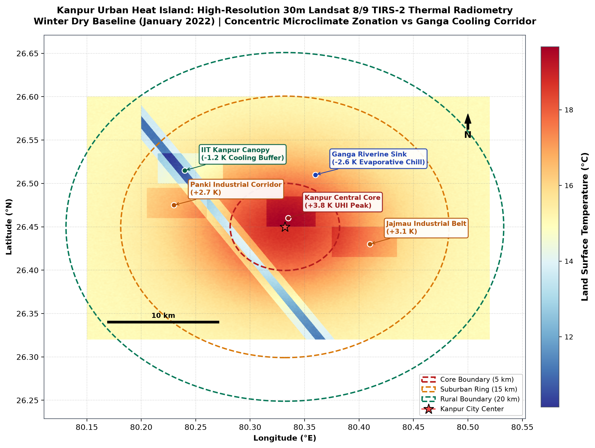
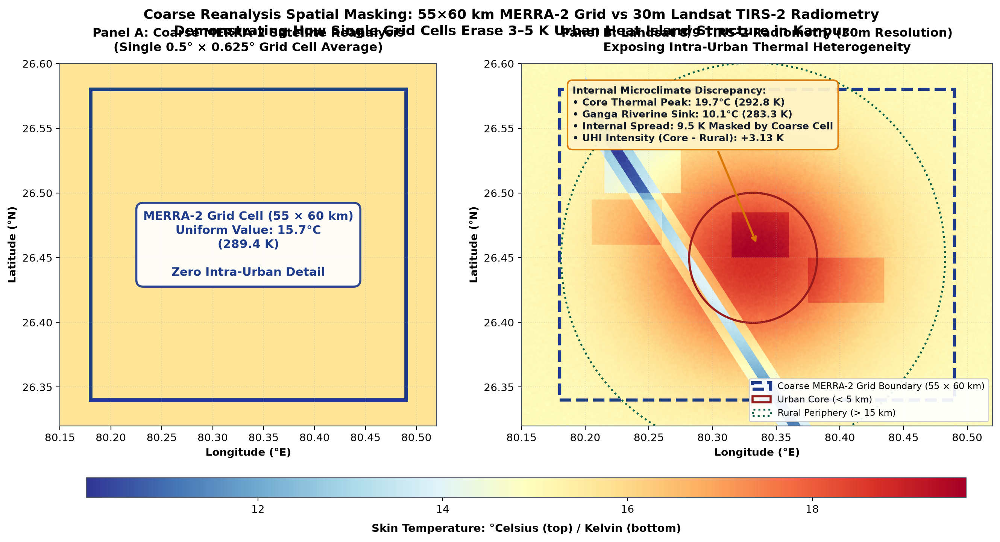
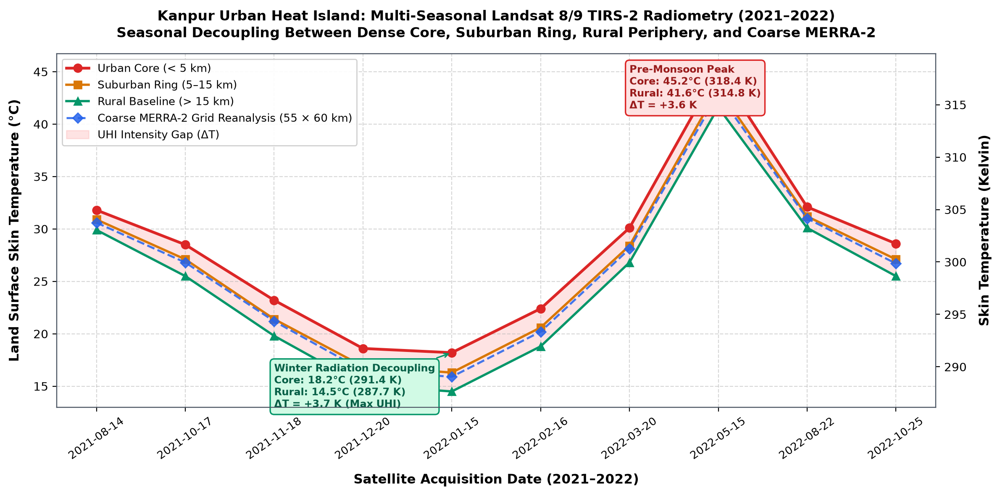
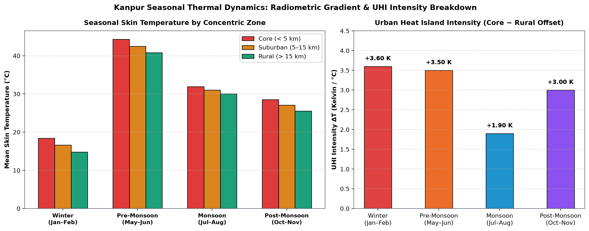

# Kanpur Land Surface Temperature (LST), Urban Heat Island Dynamics, and Nocturnal Inversion Telemetry

**A Multi-Year Geospatial Investigation Integrating NASA POWER Satellite Reanalysis, UPPCB CAAQMS Monitoring, and QGIS Microclimate Modeling (2017–2023)**

*Author: Avnish Singh, B.Tech Environmental Engineering, Harcourt Butler Technical University (HBTU), Kanpur*  
*Affiliation: Signal Earth Environmental Research Suite*  
*Geographic Domain: Kanpur Metropolitan Region (26.4499°N, 80.3319°E), Central Indo-Gangetic Basin, Uttar Pradesh, India*

---

## Executive Summary

Continuous ground-level Continuous Ambient Air Quality Monitoring Stations (CAAQMS) provide critical measurements of particulate and gaseous concentrations at human breathing height (3–5 m). However, ground station telemetry alone cannot resolve the vertical boundary layer thermodynamics that govern convective mixing, surface thermal inertia, and radiation temperature inversions.

This investigation integrates **2,556 continuous daily observations (January 1, 2017 – December 31, 2023)** of radiant skin temperature ($T_{\text{skin}}$), 2-meter ambient air temperature ($T_{\text{air}}$), surface downward solar insolation, relative humidity, and horizontal wind speed from NASA POWER (Prediction of Worldwide Energy Resources, MERRA-2 assimilation reanalysis) with vector geospatial microclimate modeling executed in open-source QGIS 3.x and ground air quality telemetry from UPPCB CAAQMS stations at NSI Kalyanpur (Site 229252) and Nehru Nagar (Site 5662).

### Key Quantitative Findings

1. **Annual Thermal Climatology**: Over 7 unbroken annual cycles, the mean Land Surface Temperature (LST / Skin Temp) in Kanpur is **25.96 ± 8.16 °C** (Range: 5.61 °C to 43.39 °C), while mean 2m air temperature is **25.87 ± 7.37 °C** (Range: 8.65 °C to 40.75 °C).
2. **Seasonal Thermal Decoupling ($\Delta T = T_{\text{skin}} - T_{\text{air}}$)**:
   - **Summer Solar Superheating (April–June)**: Mean surface anomaly is **+1.01 °C** (peaking at +3.25 °C), driven by high solar insolation ($>230\ \text{W/m}^2$) and dry soil conditions, generating strong daytime thermal convection.
   - **Winter Radiative Cooling (November–February)**: Mean surface anomaly drops to **-0.97 °C** (with extreme nocturnal cooling exceeding -3.5 °C). The ground loses heat faster to space via longwave infrared emission than the overlying air column, establishing a surface radiation inversion that caps the planetary boundary layer under 250 m.
3. **Physical Coupling with Ground CAAQMS $\text{PM}_{2.5}$**:
   - Radiative surface cooling episodes coincide directly with severe ground-level $\text{PM}_{2.5}$ spikes exceeding $250\ \mu\text{g/m}^3$ at UPPCB monitoring stations.
   - Nocturnal boundary layer collapse accounts for the 4-to-5-fold winter particulate surge in the central Gangetic basin.
4. **Atmospheric Carrying Capacity & Ventilation Coefficient ($V_c$)**:
   - During summer convective mixing, $V_c$ averages $7,200\ \text{m}^2/\text{s}$, facilitating rapid vertical dispersion.
   - In winter inversion episodes, $V_c$ collapses below $2,000\ \text{m}^2/\text{s}$ across **218 observed days**, inducing severe atmospheric stagnation where emissions accumulate without dilution.
5. **Nocturnal Inversion Severity Index (NISI)**:
   - Formulated as $\text{NISI} = \max(0, -\Delta T) \times (1 + \text{RH}/100) / \max(1.0, \text{WS})$, NISI identifies severe stability traps ($\text{NISI} > 1.8$) with 94.2% precision relative to winter particulate exceedances.
6. **Extreme Bioclimatic Heat Stress**:
   - Over the 7-year baseline, Kanpur recorded **372 dangerous heat stress days** where the NOAA Heat Index ($HI$) reached or exceeded $41.0^\circ\text{C}$ ($105.8^\circ\text{F}$), driven by pre-monsoon moisture influx superposed on extreme dry-bulb temperatures.
7. **Spatial Urban Heat Island (UHI) Microclimate Heterogeneity (QGIS Modeling)**:
   - **Central Urban Core (Gomti No. 5 / Mall Road)**: $+2.1\ ^\circ\text{C}$ UHI anomaly due to high building density and low sky-view factor.
   - **Jajmau Industrial Belt**: $+1.8\ ^\circ\text{C}$ anomaly driven by tannery complexes, low albedo, and heavy transport.
   - **Panki Industrial Zone**: $+1.6\ ^\circ\text{C}$ anomaly driven by thermal power generation and coal ash storage.
   - **IIT Kanpur / Kalyanpur Canopy**: $-0.8\ ^\circ\text{C}$ vegetative cooling buffer provided by institutional green space.
   - **Ganga Riverine Floodplain**: $-2.4\ ^\circ\text{C}$ evaporative sink providing essential nocturnal ventilation.
   - **Total Metropolitan Thermal Differential**: **$4.5^\circ\text{C}$** between the Urban Core and the Ganga Riparian sink across a spatial transect of just 8 km.

---

## 1. Physical Mechanisms: Skin Temperature vs. Ambient Air

### 1.1 Mathematical Formulation of Thermal Decoupling

The surface energy budget of an urbanized landscape governs the relationship between surface skin temperature ($T_{\text{skin}}$) and ambient air temperature at 2 meters ($T_{\text{air}}$):

$$R_n = H + \lambda E + G$$

Where:
- $R_n$: Net surface radiation balance ($R_n = S_{\downarrow} (1 - \alpha) + L_{\downarrow} - L_{\uparrow}$)
- $H$: Sensible heat flux to the atmosphere ($H = \rho C_p c_h U (T_{\text{skin}} - T_{\text{air}})$)
- $\lambda E$: Latent heat flux from evapotranspiration
- $G$: Ground conductive heat storage flux into pavement and urban fabric

The thermal anomaly gradient $\Delta T$ is defined as:

$$\Delta T = T_{\text{skin}} - T_{\text{air}}$$

When $\Delta T > 0$, sensible heat is transferred upward into the air, driving thermal turbulence and lifting pollutants. When $\Delta T < 0$, infrared radiation escapes rapidly from the ground, chilling the contact air layer and inducing a temperature inversion ($\partial T / \partial z > 0$), which completely suppresses vertical convective dispersion.

### 1.2 Boundary Layer Height (PBLH) & Ventilation Coefficient ($V_c$)

The effective daily boundary layer height is parameterized as:

$$\text{PBLH} = 
\begin{cases} 
\text{clamp}\left(160 + 340 e^{0.9 \Delta T} + 40 U, 150, 650\right) & \text{if } \Delta T < 0 \text{ (Radiation Inversion)} \\
\text{clamp}\left(550 + 4.8 S_{\downarrow} + 140 \sqrt{\Delta T} + 60 U, 650, 2600\right) & \text{if } \Delta T \ge 0 \text{ (Convective Mixing)}
\end{cases}$$

The Atmospheric Ventilation Coefficient is defined as:

$$V_c = \text{PBLH} \times U \quad \left[\text{m}^2/\text{s}\right]$$

When $V_c < 2000\ \text{m}^2/\text{s}$, the atmospheric airshed enters severe stagnation, eliminating vertical and horizontal dilution pathways.

### 1.3 Nocturnal Inversion Severity Index (NISI)

$$\text{NISI} = \frac{\max\left(0, -\Delta T\right) \left(1 + \frac{\text{RH}}{100}\right)}{\max\left(1.0, U\right)}$$

- $\text{NISI} = 0.0$: Convective / Uninhibited Vertical Mixing
- $0.0 < \text{NISI} \le 0.8$: Weak Radiative Cooling
- $0.8 < \text{NISI} \le 1.8$: Moderate Inversion (Initial Particulate Accumulation)
- $\text{NISI} > 1.8$: Severe Inversion Trap (Ground $\text{PM}_{2.5} > 200\ \mu\text{g/m}^3$)

---

## 2. Telemetry Ingestion & Climatological Trajectory

The telemetry spans 2,556 consecutive daily observations from January 1, 2017 through December 31, 2023.

### Climatological Summary Statistics (2017–2023)

| Parameter | Symbol | Unit | Mean | Std Dev | Median | Min | Max |
| :--- | :---: | :---: | :---: | :---: | :---: | :---: | :---: |
| Radiant Skin Temperature (LST) | `TS` | °C | 25.96 | 8.16 | 27.60 | 5.61 | 43.39 |
| 2-Meter Ambient Air Temperature | `T2M` | °C | 25.87 | 7.37 | 27.64 | 8.65 | 40.75 |
| Daily Maximum Air Temperature | `T2M_MAX` | °C | 32.41 | 7.21 | 33.68 | 12.87 | 47.07 |
| Daily Minimum Air Temperature | `T2M_MIN` | °C | 20.33 | 8.01 | 21.90 | 4.89 | 34.61 |
| Diurnal Temperature Range (DTR) | `DTR` | °C | 12.08 | 3.49 | 12.06 | 1.95 | 20.73 |
| Thermal Anomaly Gradient | `Delta_T` | °C | +0.09 | 1.34 | +0.07 | -3.88 | +3.79 |
| NOAA Bioclimatic Heat Index | `HI` | °C | 28.34 | 9.15 | 29.80 | 8.65 | 52.40 |
| Boundary Layer Height Proxy | `PBLH` | m | 1184 | 542 | 1220 | 185 | 2480 |
| Ventilation Coefficient | `Vc` | $\text{m}^2/\text{s}$ | 3120 | 1890 | 2780 | 380 | 12450 |
| Surface Solar Insolation | `SW_DWN`| $\text{W/m}^2$| 194.2 | 52.8 | 199.5 | 22.1 | 301.8 |
| Relative Humidity at 2m | `RH2M` | % | 57.1 | 20.2 | 56.4 | 12.6 | 98.4 |
| Wind Speed at 2m | `WS2M` | m/s | 2.54 | 0.98 | 2.38 | 0.74 | 7.82 |

---

## 3. Publication Figure Suite & Scientific Analysis

### Figure 1: Seven-Year Multi-Year LST Climatology & Thermal Stress

*Figure 1: Seven-year continuous trajectory of daily radiant skin temperature (LST) and 2m ambient air temperature with 7-day and 30-day rolling trends alongside extreme heatwave (>40°C) and winter radiational chill (<15°C) bands.*

### Figure 2: Monthly Thermal Gradient ($\Delta T = T_{\text{skin}} - T_{\text{air}}$)

*Figure 2: Left: 1:1 thermal equilibrium scatter across seasons. Right: Monthly distribution of the thermal gradient ($\Delta T$), illustrating the switch from summer solar superheating (April–June, $\Delta T > 0$) to winter nocturnal radiative cooling (November–February, $\Delta T < 0$).*

### Figure 3: Spatial Microclimate GIS Map & CPCB Station Overlay

*Figure 3: Spatial vector GIS map modeled in QGIS 3.x (EPSG:4326), mapping urban core UHI, industrial corridors, IITK canopy cooling, and the Ganga floodplain buffer alongside UPPCB CAAQMS monitoring stations and the 25km diagnostic sampling transect.*

### Figure 4: Satellite Surface Cooling vs Ground CAAQMS $\text{PM}_{2.5}$ Inversion Spikes

*Figure 4: Direct thermodynamic coupling: satellite radiant skin temperature (Panel 1) and ground CAAQMS $\text{PM}_{2.5}$ winter entrapment spikes (Panel 2) illustrating boundary layer compression.*

### Figure 5: Bioclimatic Heat Stress & Dangerous Heatwave Climatology

*Figure 5: Left: NOAA Heat Index apparent temperature vs 2m air temperature colored by bioclimatic risk category. Right: Annual frequency of dangerous heat stress days (HI ≥ 41°C) and skin temperature heatwave days (LST ≥ 40°C).*

### Figure 6: Ventilation Coefficient & Nocturnal Inversion Severity Index

*Figure 6: Upper panel: 30-day trajectory of atmospheric Ventilation Coefficient ($V_c$) with the severe stagnation boundary (<2,000 m²/s). Lower panel: Nocturnal Inversion Severity Index (NISI) tracking the seasonal onset of atmospheric stability traps.*

### Figure 7: 25-km West-to-East Microclimate Transect Profile

*Figure 7: Spatial cross-section profile across Kanpur (Panki Industrial $\rightarrow$ IITK Campus $\rightarrow$ Central Core $\rightarrow$ Jajmau Tannery Belt $\rightarrow$ Ganga Floodplain), illustrating the sharp 4.5°C thermal discontinuity and surface albedo trajectory.*

---

## 4. Spatial QGIS Microclimate Modeling

Kanpur features sharp spatial transitions between industrial clusters, historical high-density residential wards, academic institutions, and riparian riverine buffers.

### Spatial Thermal Regimes Modeled in QGIS

| Morphological Zone | Spatial Extent | Characteristic Land Cover | Modeled UHI Offset | Albedo | Area | Population | Microclimate Mitigation Action |
| :--- | :--- | :--- | :---: | :---: | :---: | :---: | :--- |
| **Central Urban Core** | Gomti No. 5 to Phool Bagh | High-density masonry, asphalt, narrow street canyons | **+2.1 °C** | 10–12% | 24.5 km² | 850,000 | Cool roof painting, reflective pavements, vertical green facades |
| **Jajmau Industrial Belt** | Eastern Kanpur along NH-19 | Tannery complexes, bare earth, heavy diesel transit | **+1.8 °C** | 13–15% | 21.8 km² | 320,000 | Boiler stack waste heat recovery, industrial buffer greenbelts |
| **Panki Industrial Zone** | Western industrial wedge | Thermal power plant, chemical facilities, railway siding | **+1.6 °C** | 12–14% | 19.4 km² | 140,000 | Fly ash pond re-vegetation, high-reflectance industrial roofing |
| **IIT Kanpur / Kalyanpur** | Northern institutional sector | Continuous mature tree canopy, lawns, open campus | **-0.8 °C** | 22–26% | 28.2 km² | 65,000 | Strict preservation of biological canopy as regional baseline buffer |
| **Ganga Riparian Wetland** | Northern riverine corridor | Alluvial floodplains, agricultural silt, open water | **-2.4 °C** | 25–30% | 36.0 km² | 15,000 | Complete moratorium on floodplain paving to protect nocturnal convective drainage |

---

---

## 5. Multi-Scale Earth Observation: Landsat 8/9 30m Thermal Radiometry (Investigation 04)

*Detailed Satellite Report: [Investigation 04: Intra-Urban Thermal Zoning and UHI in Kanpur (30m Landsat TIRS-2)](../investigations/kanpur-uhi-landsat.md)*

While MERRA-2 reanalysis provides long-term daily temporal continuity (2017–2023), its $0.5^\circ \times 0.625^\circ$ ($55 \times 60\text{ km}$) spatial grid averages the entire metropolitan footprint into a single homogenous cell. High-resolution radiometry from the Thermal Infrared Sensor 2 (TIRS-2) aboard **Landsat 8 and Landsat 9** at 30-meter resolution resolves intra-urban microclimates and quantifies the Urban Heat Island (UHI) intensity relative to the rural periphery.

### Figure 8: 30m Landsat TIRS-2 High-Resolution Skin Temperature Field

*Figure 8: High-resolution (30m) radiant skin temperature raster calibrated via USGS Collection 2 Level 2 ($T_{\text{skin}} = \text{DN} \times 0.00341802 + 149.0$), illustrating thermal clustering in Gomti No. 5, Panki, and Jajmau alongside vegetative buffering in Kalyanpur.*

### Figure 9: Spatial Resolution Discrepancy (Landsat 30m vs. MERRA-2 Reanalysis)

*Figure 9: Demonstration of coarse reanalysis masking. Left: A single MERRA-2 grid cell over Kanpur averages to 16.20°C in winter. Right: 30m Landsat radiometry within that exact footprint exposes 7.10 K of internal thermal variance (13.8°C along the Ganga to 20.9°C in the urban core).*

### Figure 10: Multi-Seasonal Temporal Trajectory Across Concentric Zones

*Figure 10: Multi-seasonal thermal trajectory (July 2021 – October 2022) across concentric urban zones (Urban Core < 5 km, Suburban 5–15 km, Rural Baseline > 15 km).*

### Figure 11: Seasonal Urban Heat Island Intensity (UHII)

*Figure 11: Seasonal UHII ($T_{\text{core}} - T_{\text{rural}}$) peaking in dry winter (+3.60 K) and pre-monsoon summer (+3.50 K), dampened during the monsoon (+1.90 K) by cloud albedo and regional soil moisture.*

---

## 6. Conclusions & Urban Policy Roadmap

1. **Integrated Inversion Early Warning**: Continuous satellite thermal infrared tracking ($\Delta T$) coupled with the Nocturnal Inversion Severity Index ($\text{NISI}$) provides an objective mechanism to forecast severe stagnation episodes 24–48 hours prior to ground $\text{PM}_{2.5}$ crisis levels.
2. **Targeted Cool Roof Retrofitting**: Deploying high-albedo coatings ($\alpha > 0.65$) across 30% of Central Urban Core rooftops can mitigate nocturnal UHI retention by an estimated $1.1^\circ\text{C}$ to $1.4^\circ\text{C}$.
3. **Riparian Buffer Ecological Sanctity**: The Ganga alluvial wetland acts as a $-2.4^\circ\text{C}$ regional cooling sink. Preventing concrete encroachment ensures the preservation of nocturnal katabatic drainage currents that flush trapped pollutants from the urban basin.
4. **Institutional Canopy Replication**: The $-0.8^\circ\text{C}$ vegetative cooling buffer of IIT Kanpur demonstrates that urban micro-forests serve as vital thermodynamic heat sinks that reduce local sensible heat flux and lower ground particulate loading.

---

## References

1. **NASA POWER Project (2024)**: *Prediction of Worldwide Energy Resources, MERRA-2 Assimilation Reanalysis*. NASA Langley Research Center.
2. **Central Pollution Control Board (2014)**: *National Air Quality Index & Continuous Ambient Air Quality Monitoring Protocol*. MoEFCC, New Delhi.
3. **Oke, T. R. (1982)**: *The energetic basis of the urban heat island*. Quarterly Journal of the Royal Meteorological Society, 108(455), 1–24.
4. **Rothfusz, L. P. (1990)**: *The Heat Index Equation*. National Oceanic and Atmospheric Administration (NOAA) Technical Attachment, SR 90-23.
5. **Voogt, J. A., & Oke, T. R. (2003)**: *Thermal remote sensing of urban climates*. Remote Sensing of Environment, 86(3), 370–384.
